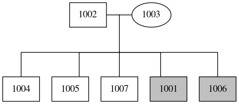

# ped_draw
A simple python script to draw pedigrees with graphviz



## Usage
Make dot (to stdout):
```
python ped_to_dot.py $PED
```
or from stdin

```
grep ^kindred01 $PED | python ped_to_dot.py /dev/stdin
```

Make dot, png and view:
```
python ped_to_dot.py $PED | dot -T png -o your.png ; eog your.png
```

## Examples
Examples can be found in examples/

## Limitations
- Only works on 2 generation pedigrees (parents and their children)
- Only works on single families with the same kindred ID, subset your ped file and use /dev/stdin for multiple kindred peds
- `dev/ped_to_dot_3gen_dev.py` is a work in progress for 3+ generation pedigree drawing
