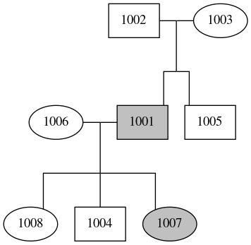
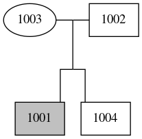
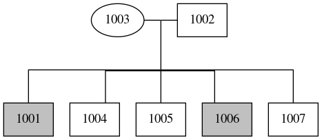

# ped_draw
A simple python script to draw (complex and multi generation!) pedigrees with graphviz



## Install
```
git clone https://github.com/mvelinder/ped_draw.git
```

## Usage
ped_draw reads in a ped file (from a specified file or from /dev/stdin) and generates a dot file (to stdout). The subsequent dot output can be piped directly to dot/[graphviz](https://graphviz.gitlab.io/) to generate png, svg, pdf, ps, or any other image option available in the graphviz [documentation](https://www.graphviz.org/pdf/dotguide.pdf).

**Example:**
Make dot from $PED file (can also read from /dev/stdin) and write to stdout
```
python ped_to_dot.py $PED
```

**Example:**
Make dot from $PED file, save a png and view with eog:
```
python ped_to_dot.py $PED | dot -T png -o your.png ; eog your.png
```

## Requirements
- [python](https://www.python.org/) 2.7.15 or greater
- to-spec, tab separated [ped](https://gatkforums.broadinstitute.org/gatk/discussion/7696/pedigree-ped-files) file input, including a header line
- dot/[graphviz](https://graphviz.gitlab.io/)
- (optional) [eog](https://wiki.gnome.org/Apps/EyeOfGnome) or any other image viewing app

## Examples
Numerous examples are in [examples/](examples/)

#### "quartet" pedigree


#### "septet" pedigree


## Web App
### [peddraw.github.io](https://peddraw.github.io/)
is a fully featured web app, where users can paste ped files directly into the app or upload ped files from their local machine to generate and display image files

## Citation
ped_draw is published in [BMC Bioinformatics](https://bmcbioinformatics.biomedcentral.com/articles/10.1186/s12859-020-03917-4)

## Considerations and Limitations
- All affected individuals are shaded grey (as per ped file specs), this cannot currently be changed
- Unaffected sample status can be encoded as 0 or 1 in the input ped file
- Affected sample status **must** be encoded as 2 in the input ped file
- Sample sex is indicated as 1 for male and 2 for female (as per ped file specs), samples with a sex of 0 will be drawn as a diamond (also per ped file specs)
- Drawn relatedness is based on the relatedness described in the child row of the ped file, if a parent sample is described in the child row but not as its own unique row in the ped file, the relatedness will still be drawn, based ont he description in the child row
- If a sample is provided and no relatedness is described between any other samples, the sample will be drawn offset and unconnected to the pedigree
- In pedigrees with 8 or more children per set of parents there will be overlapping and/or disjointed lines
- Does not currently support single parent-child combinations
- Does not currently support monozygotic or dizygotic twins, as this information is not capable of being indicated in a standard ped file
- Does not currently support drawing genotypes or additional information on specific samples
