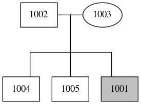
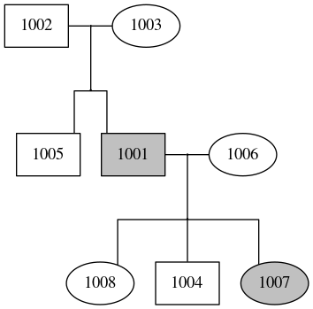
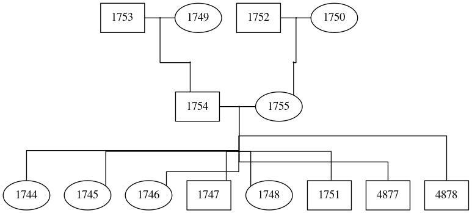

# ped_draw
A simple python script to draw (complex, multi generation!) pedigrees with graphviz



## Install
```
git clone https://github.com/mvelinder/ped_draw.git
```

## Usage
Make dot (to stdout), can also read from /dev/stdin:
```
python ped_to_dot.py $PED
```

Make dot, save png and view with eog:
```
python ped_to_dot.py $PED | dot -T png -o your.png ; eog your.png
```

## Requirements
- [python](https://www.python.org/) 2.7.15 or greater
- to-spec, tab separated [ped](https://gatkforums.broadinstitute.org/gatk/discussion/7696/pedigree-ped-files) file input
- dot/[graphviz](https://graphviz.gitlab.io/)
- [eog](https://wiki.gnome.org/Apps/EyeOfGnome) or otherwise for viewing

## Examples
Are in examples/

#### "septet" pedigree


#### 3 generation pedigree


#### 4 generation pedigree


## Limitations
- For best behavior, put parent-pairs on adjacent rows in ped file, if you're getting convoluted lines between parents, try sorting and piping into ped_draw with `sort -k3 -g $PED | sort -k4 -g | python ped_to_dot.py`
  - 
  - sort
  - 
- Some slightly wonky lines with 8 or more children per set of parents
